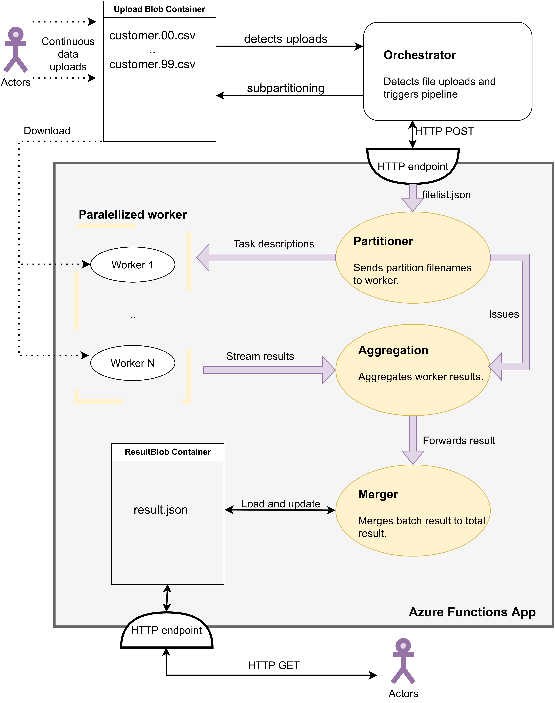

# Serverless Distributed Data Processing Pipeline

In this project, we built a distributed data processing pipeline using Azure Functions.

The pipeline receives CSV files containing customer data and calculates the mean customer account balance per country for demographic analysis purposes.

## Design

Our solution is a **multi-stage** pipeline, with a different Azure function for each stage (i.e. 1. partitioning, 2. aggregating, 3. merging). It is **scalable**, it allows for multiple function instances to process data in parallel in case of handling large data amounts. 

Each function is **stateless** and is able to share data between instances. There are different means of sharing state between the stages in Azure with Azure Blob Storage and Azure Queue.

## Evaluation

We compare Azure Queues and Azure Blob Storage in terms of data processing speed, resource usage, and monetary cost. We document the pros and cons of each implementation, and provide a recommendation for the best approach depending on the specific use case in [our report](./media/report.pdf).

## Dataset

The dataset that we use is the customers table from the TPC-H benchmark, which is a benchmark widely used in research to benchmark databases.

A 1 GB file can be downloaded from an internal server at TU Munich: 

```
wget https://db.in.tum.de/teaching/ws2223/clouddataprocessing/data/customer.csv
```

If the download is not available, find tools and instructions on how to generate a larger dataset [here](testing_data/).
Use following script to partition it in 100 chunks:

```
cd testing_data
chmod +x splitCSV.sh
./splitCSV.sh customer.csv
```

## Setup

Follow our [setup instructions](./setup.md) to use the written software.

## Documentation

This project was created in context of course work at the TU Munich. Our report can be found [here](./media/report.pdf). Here a system overview:




## Background Literature

More about the current state of serverless computing as well as some interesting research systems can be found here:

Survey Papers:
- Serverless Computing: One Step Forward, Two Steps Back
- Le Taureau: Deconstructing the Serverless Landscape & A Look Forward

Systems from Academia:
- Lambada: Interactive Data Analytics on Cold Data Using Serverless Cloud Infrastructure
- Starling: A Scalable Query Engine on Cloud Functions