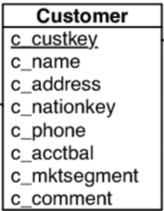

# Serverless Distributed Data Processing Pipeline

In this project, you will have to build a distributed data processing pipeline using Azure Functions.


## Implementation


- Decide on the different functions that will make your pipeline.

- Configure the triggers and bindings used by the functions (e.g. Blob Storage triggers, message queue triggers, timer triggers)

- Write the code for the functions, which will perform the different data processing tasks (e.g. filtering, partitioning, aggregating data)

- Test the pipeline locally using the Azure Functions Core Tools ([Documentation](https://learn.microsoft.com/en-us/azure/azure-functions/functions-run-local?tabs=v4%2Clinux%2Ccsharp%2Cportal%2Cbash), [GitHub](https://github.com/Azure/azure-functions-core-tools)) to ensure that it is working as expected. The Azure Functions Core Tools include a local development server and an emulator for the Azure Functions runtime, which enables you to test your functions without having to deploy them to the cloud. 

- To use the Azure Functions Core Tools, you will need to install them on your development machine and then create a local Azure Functions project using the Azure Functions CLI or Visual Studio. You can then develop and debug your functions locally using the tools, and use the emulator to simulate the triggers and bindings that your functions will use when they are deployed to the cloud.

## Deploy on Azure Functions

- Once you have tested your functions locally and are satisfied with their behavior, you can deploy them to the cloud and start consuming cloud credits by using the ```az functionapp create```  and  ```az functionapp publish``` commands to create and deploy your Azure Functions app to an Azure subscription.

- Use the Azure Functions CLI ([GitHub](https://github.com/Azure/azure-functions-cli)) to create and deploy an Azure Functions app. ([Plugin for VS Code](https://learn.microsoft.com/en-us/azure/azure-functions/functions-develop-vs-code?tabs=csharp), [Plugin for Visual Studio](https://learn.microsoft.com/en-us/azure/azure-functions/functions-develop-vs?tabs=in-process))

- Optimize the pipeline as needed by monitoring, scaling the number of functions, adjusting the triggers and bindings, or implementing more efficient shared state management.

## Shared Storage Options

Some of the options for sharing state in the Azure ecosystem are the following:

- Azure Blob Storage: This option allows you to store state in Azure Blob Storage, which is a cloud-based file storage service. This option is suitable for scenarios where you need to store large amounts of data that needs to be persisted across function executions.
- Azure Table Storage: This option allows you to store state in Azure Table Storage, which is a NoSQL key-value store. 
- Azure Queue Storage: This option allows you to store state in Azure Queue Storage, which is a cloud-based message queue service. This option is suitable for scenarios where you need to store state that needs to be persisted across function executions and is not sensitive to high latency. 
- Azure Redis Cache: This option allows you to store state in Azure Redis Cache, which is a in-memory data store that supports various data structures. This option is suitable for scenarios where you need to store state that needs to be persisted across function executions and requires low latency.
- Azure Cosmos DB: This option allows you to store state in Azure Cosmos DB, which is a NoSQL database that supports a variety of data models and APIs. 

Υou will have to use some of them and compare them.

## Trigger Options

There are several types of triggers that can be used to invoke Azure Functions. Some of them are the following:

- HTTP triggers: These triggers are activated by HTTP requests. They can be used to create APIs or to respond to webhooks.

- Timer triggers: These triggers allow you to schedule your functions to run at a specific time or on a specific schedule.

- Blob storage triggers: These triggers allow you to respond to changes in Azure Blob storage, such as the creation of a new blob or the update of an existing blob.

- Queue storage triggers: These triggers allow you to process messages from an Azure Queue storage queue.


## Workload, Tasks and Requirements

DISCLAIMER: This part is still in draft mode, dataset and query might change, but it will definitely involve processing of CSV files and a similar/the same query.

### Load test dataset

A test dataset you can use is the customer table from the TPC-H benchmark. You can download a 1 GB file to start with from our server. You can find tools and instructions on how to generate a larger dataset [here](testing_data/).

```
wget https://db.in.tum.de/teaching/ws2223/clouddataprocessing/data/customer.csv
```

### Split into 100 partitions

```
cd testing_data
chmod +x splitCSV.sh
./splitCSV.sh customer.csv
```

### Table Columns



The dataset is a CSV file with 8 data columns (customer key, customer name, address, nation key, phone, account balance, market segment, comment)

### Example Query
- Find the mean customer account balance per nation. (for each value of the 4th column, find the mean value of the 6th column)


### Tasks

- Draw a high level diagram of your pipeline, showing the different types of functions that you are using with their inputs and outputs being shown clearly. Explain your design decisions, and evaluate it in terms of non-functional requirements (performance, fault-tolerance).
- Implement a working solution using Azure stateless functions,  for the following use cases.

### Use Cases
- Static: Store all your data partitions to an Azure Blob and process them to return the result of the query.
- Dynamic: Write a script that uploads data partitions to an Azure Blob with time intervals, to check if your triggers are working correctly, and the result is updated in an event-driven fashion.

### Requirements


### Tips
- Start simple and implement the data processing part stage by stage. You can first use a single function per stage and a small dataset. When you get it working, make it scalable.


## Draft Report Questions

Potential Questions:
- How do different approaches to storing intermediate results, such as using a message queue, a shared database, or a distributed data structure, impact  the overall performance and efficiency of the pipeline?
- How do different approaches to triggering the functions in the pipeline, such as using a timer trigger or an event trigger, impact the overall performance and efficiency of the pipeline?
- How do different approaches to scaling the pipeline, such as using autoscaling or manually adjusting the number of functions, impact the overall performance and efficiency of the pipeline?
- How do different approaches to handling stragglers, such as using retries or timeouts, impact the overall performance and efficiency of the pipeline?

## Submission:
You can submit everything via GitLab.
First fork this repository, and add all members of your group to a single repository.
Then, in this group repository, add:
* Names of all members of your group in a groupMembers.txt file
* Code that implements the assignment
* Test scripts that demonstrate the capabilities of your solution
* A written report giving a brief description of your implementation, and answering the design questions.

