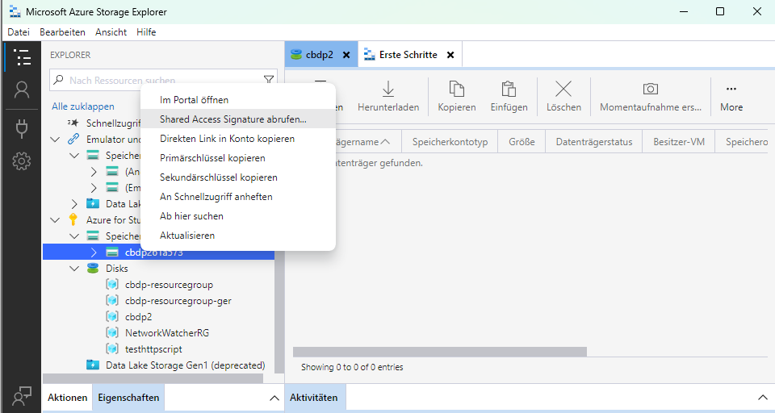

# Setup
Instructions to use the software.

## Account setup
- Create function app in Azure (can also be done with VSCode). A corresponding storage account will be automatically created with the function app.
- Check the name of the freshly created storage account (either the name of the function app or the name with a random suffix) and use it to fill in [STORAGE_ACC_NAME](./src/main/java/com/function/config/AccountConfig.java).
- Get SAS token of storage account. Can be for example accessed via the Microsoft Azure Storage Explorer: . 

Copy SAS token (not the connection string) to the [STORAGE_ACC_SAS_TOKEN](./src/main/java/com/function/config/AccountConfig.java) variable.
- Get primary key of storage account. Can be for example accessed via the Microsft Azure Storage Explorer: . 

Copy to [STORAGE_ACC_PRIM_KEY](./src/main/java/com/function/config/AccountConfig.java)

## Create required Azure queues and blob containers
Execute [Initialization.java](./src/main/java/com/function/Initialization.java). Execution can be done in any way and can also be done with VSCode. Script initializes all needed containers, queues and potentially more.  
The pipeline is now set up and can be run locally, as well as on Microsoft Azure.

# Execution
## Running locally
### VSCode
Instructions can be found on [Azure tutorial](https://learn.microsoft.com/en-us/azure/azure-functions/create-first-function-vs-code-java#run-the-function-locally).
To make sure that VSCode uses proper account configuration values, run `Azure Functions: Download Remote Settings` via the `Command Palette`.

## Deploying to Azure

## Benchmarking
1. Upload the data into Azure Blob storage of the storage account of your Azure function app.
2. Deploy functions app either locally or on Azure (both works).
3. Trigger pipeline after deploying to Azure:
Copy paste the [API link](https://cbdp.azurewebsites.net/api/event-driven-pipeline/requesttype/pipeline) into your browser of choice.
https://cbdp.azurewebsites.net/api/event-driven-pipeline/result/queue 
3. Trigger pipeline locally:
Analogous to triggering after deployment but with `localhost` instead of `cbdp.azurewebsites.net/api`. 