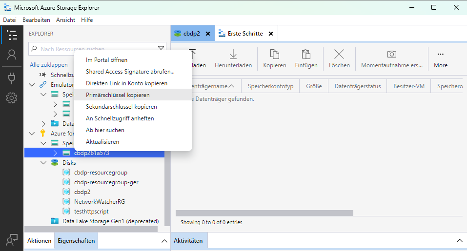

# Setup
Instructions to use the software.


## Account setup
- Create function app in Azure (can also be done with VSCode). A corresponding storage account will be automatically created with the function app.
- Check the name of the freshly created storage account (either the name of the function app or the name with a random suffix) and use it to fill in [STORAGE_ACC_NAME](./src/main/java/com/function/config/AccountConfig.java).
- Get SAS token of storage account. Can be for example accessed via the Microsoft Azure Storage Explorer: . 

Copy SAS token (not the connection string) to the [STORAGE_ACC_SAS_TOKEN](./src/main/java/com/function/config/AccountConfig.java) variable.
- Get primary key of storage account. Can be for example accessed via the Microsft Azure Storage Explorer: . 

Copy to [STORAGE_ACC_PRIM_KEY](./src/main/java/com/function/config/AccountConfig.java)

## Create required Azure queues and blob containers
Execute [Initialization.java](./src/main/java/com/function/Initialization.java). Execution can be done in any way and can also be done with VSCode. Script initializes all needed containers, queues and potentially more. <br>
The pipeline is now set up and can be run locally, as well as on Microsoft Azure.

# Execution
1. Upload the data into Azure Blob storage of the storage account of your Azure function app.
2. Deploy functions app either locally or on Azure (both works).

## Running locally
### VSCode
Instructions can be found on [Azure tutorial](https://learn.microsoft.com/en-us/azure/azure-functions/create-first-function-vs-code-java#run-the-function-locally).
To make sure that VSCode uses proper account configuration values, run `Azure Functions: Download Remote Settings` via the `Command Palette`.

## Deploying to Azure
Instructions can be found on [Azure tutorial](https://learn.microsoft.com/en-us/azure/azure-functions/create-first-function-vs-code-java).

## Running benchmarks
1. Compute batch splits by 
```bash
cd benchmarking
cd batch_generator
node index.js
cd ..
cd ..
```
2. Run a benchmark by executing [InitiateBenchmarking.java](src/main/java/com/function/InitiateBenchmarking.java) and 
```shell
<folder path to benchmark files> <post_url> <queue_type> <benchmark_run_id>
```
`<post_url>` hereby equals `https://<function_app_name>.azurewebsites.net/api/event-driven-pipeline/`,
`<queue_type>` is either `queue` or `blob`,
`<benchmark_run_id>` is the id used for getting the query completion time, and
`<folder path to benchmark files>` is the global path to the folder including the task batches.

3. Get the task completion time by executing [GetBenchmarkingResult.java](src/main/java/com/function/GetBenchmarkingResult.java) with
```shell
<benchmark_run_id> <queue_type> 
```
as arguments.
4. Results of the pipeline can always be accessed by issuing a HTTP GET request (e.g. by opening the link in a browser) to following url: `https://<function_app_name>.azurewebsites.net/api/event-driven-pipeline/`